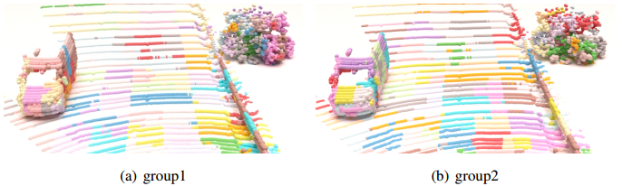
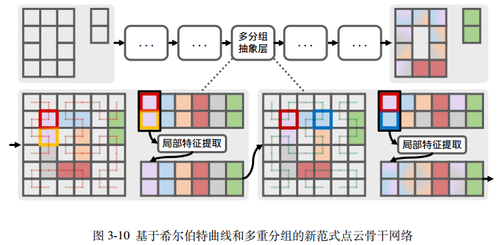
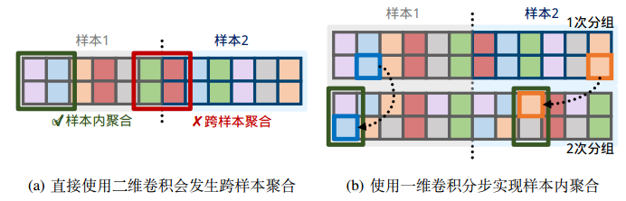
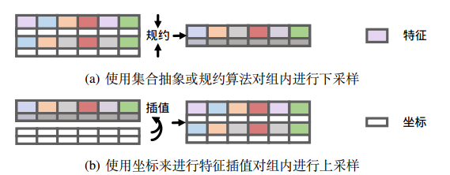

# CurFormer

## Structuring

## Feature Extraction

## Group Intersection

## Pooling & UnPooling

## Beginning
### train
`python tools/train.py --cfg configs/voxformer/voxformer_4x2_80e_kitti_3cls.py`

### eval
`python tools/test.py --cfg configs/voxformer/voxformer_4x2_80e_kitti_3cls.py --ckpt the_ckpt_in_output_dir`
